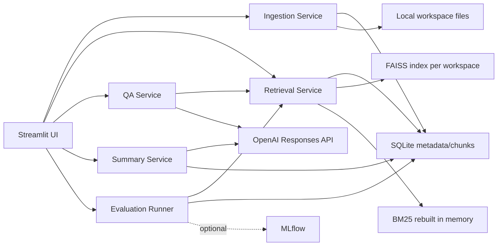

# mini-notebooklm-rag

A local-first, NotebookLM-style RAG application built for learning and portfolio review. It demonstrates the core mechanics of document ingestion, chunking, hybrid retrieval, grounded QA, summaries, and retrieval evaluation without hiding the pipeline behind LangChain or LlamaIndex.

## Why This Exists

The project is intentionally small enough to inspect and large enough to show real engineering tradeoffs:

- local document storage and SQLite metadata
- PDF/Markdown parsing
- local embeddings and FAISS indexing
- BM25 sparse retrieval
- weighted hybrid retrieval
- OpenAI-backed grounded answers with citations
- per-document summary caching
- retrieval evaluation with optional MLflow observability

It is single-user and local-first by design.

## Features

- Workspace create/select/delete.
- PDF and Markdown upload.
- Duplicate upload detection by SHA-256 hash.
- Original file preservation under local workspace storage.
- PDF page metadata and Markdown heading metadata.
- Approximate configurable chunking.
- Local embedding model through `sentence-transformers`.
- Embedding device selection: `auto`, `cuda`, or `cpu`.
- One FAISS CPU index per workspace.
- BM25 rebuilt from SQLite chunks.
- Hybrid retrieval over up to 3 selected documents.
- PDF and Markdown citation formatting.
- Grounded chat with `[S#]` source markers.
- Optional query rewriting using only the current chat session.
- Optional outside-knowledge answer mode with explicit separation.
- SQLite-backed chat history.
- Per-document overview summaries with SQLite cache.
- Retrieval evaluation cases, JSON import/export, and local eval runs.
- Optional MLflow logging through the `observability` extra.
- NotebookLM-like Streamlit layout with a Sources sidebar, center Chat workflow, and Studio tools panel.

## Architecture Summary



## Tech Stack

- Python `>=3.11,<3.13`
- `uv` for project and environment workflow
- Streamlit UI
- SQLite metadata store
- PyMuPDF PDF extraction
- `markdown-it-py` Markdown parsing
- `sentence-transformers` embeddings
- PyTorch for embedding device support
- `faiss-cpu` dense vector index
- `rank-bm25` sparse retrieval
- OpenAI SDK for QA, query rewrite, and summaries
- Optional MLflow for eval batch observability
- pytest and Ruff for validation

## Setup

```bash
uv sync
```

Copy `.env.example` to `.env` only when you need local overrides.

```bash
cp .env.example .env
```

On Windows PowerShell:

```powershell
Copy-Item .env.example .env
```

Do not commit `.env`, `.env.local`, `.local/`, or runtime `storage/` data.

## Environment Variables

Important settings:

- `OPENAI_API_KEY=`: optional; needed only for chat/query rewrite/summaries.
- `OPENAI_MODEL=gpt-4.1-nano`: default generation model.
- `OPENAI_QUERY_REWRITE_MODEL=gpt-4.1-nano`: default rewrite model.
- `EMBEDDING_MODEL_NAME=BAAI/bge-base-en-v1.5`: default local embedding model.
- `EMBEDDING_DEVICE=auto`: uses CUDA when PyTorch reports CUDA, otherwise CPU.
- `APP_STORAGE_DIR=storage`: local runtime storage root.
- `AUTO_SUMMARY=false`: cost-safe default.
- `ENABLE_QUERY_REWRITE=true`: query rewrite default.
- `ALLOW_OUTSIDE_KNOWLEDGE=false`: grounded-only default.
- `RETRIEVAL_TOP_K=6`, `DENSE_WEIGHT=0.65`, `SPARSE_WEIGHT=0.35`: retrieval defaults.
- `MLFLOW_TRACKING_URI=`: optional eval observability target.

## CUDA Notes

FAISS remains CPU-only through `faiss-cpu`. CUDA applies only to local embedding inference through PyTorch.

Use:

```env
EMBEDDING_DEVICE=auto
```

to prefer CUDA when available and fall back to CPU. Use:

```env
EMBEDDING_DEVICE=cuda
```

to require CUDA and fail clearly if unavailable. Use:

```env
EMBEDDING_DEVICE=cpu
```

to force CPU.

Check the active environment:

```bash
uv run python scripts/check_cuda.py
```

Do not install NVIDIA drivers or the full CUDA Toolkit as part of this project. If CUDA is unavailable, verify the system driver with `nvidia-smi`, then rerun `uv sync`.

## Run

Default app launcher:

```bash
uv run app
```

Debug logging:

```bash
uv run app -- --logger.level=debug
```

Direct Streamlit fallback:

```bash
uv run streamlit run src/mini_notebooklm_rag/streamlit_app.py
```

Streamlit file watching is disabled in `.streamlit/config.toml` to avoid watcher tracebacks from optional `transformers` vision modules. Do not add `torchvision` just to satisfy those optional imports.

## Demo Workflow

1. Start `uv run app`.
2. Create a workspace.
3. Upload `examples/sample_notes.md`.
4. Select the sample document in the Sources sidebar.
5. Build/rebuild the workspace index.
6. Run a retrieval debug query from Studio.
7. Add a temporary OpenAI API key or use `.env`.
8. Start a chat in the center panel.
9. Ask a grounded question and inspect `[S#]` citations.
10. Generate a document summary and confirm cache behavior.
11. Import or create eval cases, then run an eval batch.

## Workflows

### Ingestion

Uploaded PDF/Markdown files are copied into local workspace storage. The app extracts structured text blocks, chunks them, and persists document/chunk metadata in SQLite.

### Retrieval

Build a workspace FAISS index manually from the retrieval debug panel. BM25 is rebuilt in memory from SQLite chunks. Hybrid retrieval combines normalized dense and sparse scores.

### QA and Chat

Chat uses selected documents, current-session history for optional query rewrite, and OpenAI Responses API for non-streaming generation. Grounded-only mode is the default.

### Summaries

Summaries are per-document overview summaries. `AUTO_SUMMARY=false` remains the default. Summary cache rows live in SQLite and prevent repeated API calls for unchanged document/config/model combinations.

### Evaluation

Evaluation is retrieval-only. It stores workspace-specific eval cases and eval runs in SQLite, supports JSON import/export, and computes hit@k by filename/page/page range. It does not call OpenAI.

### Optional MLflow

Install observability extras only when needed:

```bash
uv sync --extra observability
```

Configure:

```env
MLFLOW_TRACKING_URI=file:./storage/mlruns
```

If `MLFLOW_TRACKING_URI` is empty or MLflow is not installed, local evaluation still works.

## Security and Privacy

- API keys may come from `.env` or the temporary Streamlit password input.
- Temporary UI keys live only in `st.session_state`.
- API keys are not stored in SQLite.
- Saved local API-key manager is not implemented.
- Uploaded documents, chunks, chat history, summaries, and eval results are local private runtime data.
- MLflow artifacts may include eval questions and compact retrieval metadata. Use remote MLflow only when that is acceptable.
- `.env`, `.env.local`, `.local/`, and `storage/*` are Git-ignored.

## Cost Control

- Ingestion, chunking, embeddings, indexing, retrieval, and retrieval evaluation are local.
- Chat, query rewrite, and summaries call OpenAI only when invoked and when an API key is configured.
- `AUTO_SUMMARY=false` is the default.
- Summary cache avoids repeated calls for unchanged inputs.
- Evaluation does not call OpenAI.

## Validate

```bash
uv sync
uv run pytest
uv run ruff check .
uv run ruff format --check .
```

Startup smoke:

```bash
uv run app
```

## Troubleshooting

Common issues:

- CUDA unavailable: run `uv run python scripts/check_cuda.py`.
- FAISS index missing/stale: rebuild the workspace index.
- OpenAI key missing: add `.env` key or temporary UI key.
- MLflow unavailable: install `uv sync --extra observability` or leave disabled.
- Streamlit watcher tracebacks: file watching is disabled by `.streamlit/config.toml`.

## Roadmap

Potential future phases:

- Docker/deployment documentation.
- Learning tools: Quiz, Flashcards, and Export.
- Saved local API-key manager.
- OCR/scanned PDF support.
- Cross-document synthesis.
- Answer-quality evaluation.
- Optional reranking experiments.
- Optional Ragas-style evaluation experiments.

## Known Limitations

- Single-user local app.
- English-first parsing/retrieval assumptions.
- Normal text PDFs only; no OCR.
- Approximate chunk sizing, no tokenizer-dependent chunking.
- FAISS deletion is handled by rebuild, not vector deletion.
- No streaming responses.
- No saved API-key manager.
- No Docker/deployment yet.
- No LangChain or LlamaIndex integration by design.
